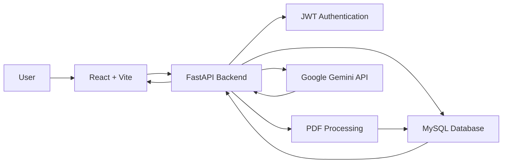
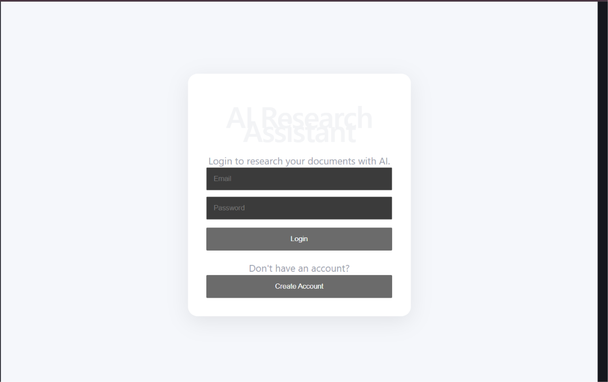
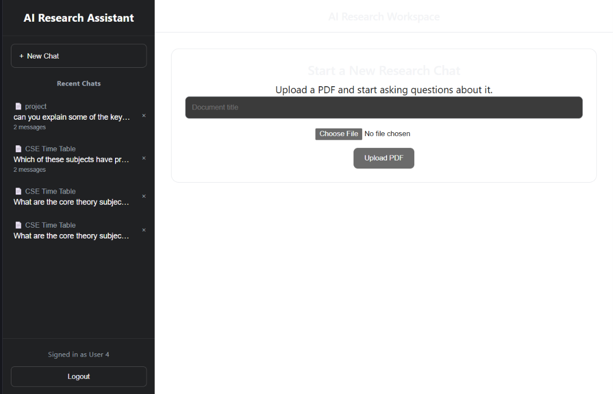
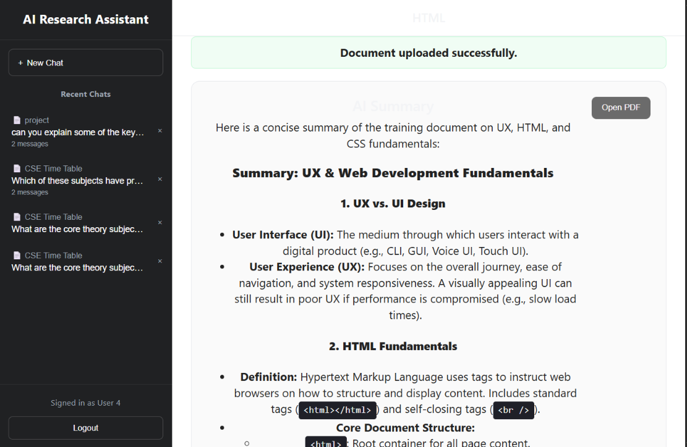
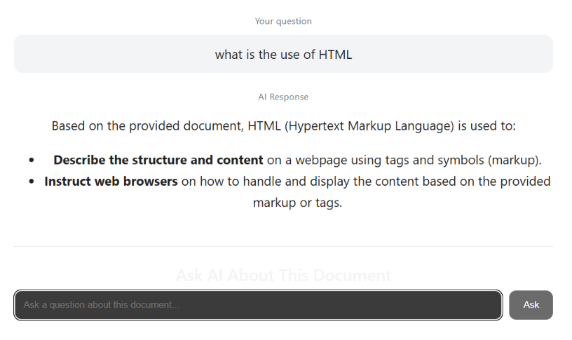

# 🤖 AI-Powered Research Assistant

> An AI-powered web application for understanding PDF documents through automatic summarization and document-based question answering.

The **AI-Powered Research Assistant** allows users to upload PDF documents, generate AI-powered summaries, ask questions about their documents, and manage conversations through a ChatGPT-style interface.

---

## 🚀 Project Overview

Research papers, technical documents, and study materials can contain a large amount of information that is difficult to process quickly.

This project provides a simple research workspace where users can:

- 🔐 Create an account and securely log in
- 📄 Upload PDF documents
- 📝 Extract text from PDF files
- 🧠 Generate AI-powered document summaries
- 💬 Ask questions about uploaded documents
- 🗂️ Continue questions within the same conversation
- 📚 View recent conversations
- 🗑️ Delete conversations
- 📖 Open uploaded PDFs securely

---

## ✨ Features

### 🔐 Secure Authentication

- User registration and login
- Password hashing using Argon2
- JWT-based authentication
- Protected backend API endpoints
- User-specific document access
- User-specific conversation access

### 📄 PDF Document Processing

- Upload PDF documents
- Extract text from uploaded PDF files
- Store document information in MySQL
- Generate AI-powered summaries
- Secure access to uploaded PDF files

### 🧠 AI-Powered Research

- Generate concise summaries from uploaded documents
- Ask questions about document content
- Generate answers using Google Gemini
- Markdown rendering for AI-generated responses
- Prompting designed to reduce unsupported answers

### 💬 Conversation Management

- Store multiple chat messages in one conversation
- Generate and store a unique `conversation_id`
- Display recent conversations in the sidebar
- Show message counts for conversations
- Continue asking questions inside an existing conversation
- Delete an entire conversation

### 🖥️ ChatGPT-Style Workspace

- Dark sidebar
- New Chat functionality
- Recent conversation history
- Document summary area
- AI question and answer area
- Secure Open PDF functionality
- Logout functionality

---

## 🛠️ Technology Stack

| Category | Technologies |
|---|---|
| Frontend | React, Vite, JavaScript |
| UI / Rendering | React Markdown |
| Backend | Python, FastAPI |
| Validation | Pydantic |
| ORM | SQLAlchemy |
| Database | MySQL |
| Authentication | JWT, Argon2 |
| AI | Google Gemini API |
| PDF Processing | PyPDF |
| Version Control | Git, GitHub |

---

## 🏗️ System Architecture



---

## 🔄 Application Workflow

```text
                    ┌────────────────────┐
                    │        User        │
                    └─────────┬──────────┘
                              │
                              ▼
                    ┌────────────────────┐
                    │ React + Vite       │
                    │ Frontend           │
                    └─────────┬──────────┘
                              │
                              ▼
                    ┌────────────────────┐
                    │ FastAPI Backend    │
                    └──────┬─────┬───────┘
                           │     │
                ┌──────────┘     └───────────┐
                ▼                            ▼
       ┌────────────────┐           ┌────────────────┐
       │ PDF Processing │           │ MySQL Database │
       └────────┬───────┘           └────────────────┘
                │
                ▼
       ┌────────────────┐
       │ Google Gemini  │
       │      AI        │
       └────────────────┘
```

### Detailed Flow

```text
1. User creates an account or logs in
              ↓
2. JWT token authenticates the user
              ↓
3. User uploads a PDF
              ↓
4. FastAPI receives the file
              ↓
5. PDF text is extracted
              ↓
6. Document information is stored in MySQL
              ↓
7. Extracted content is sent to Gemini
              ↓
8. Gemini generates an AI summary
              ↓
9. User asks questions about the document
              ↓
10. FastAPI processes the question
              ↓
11. Gemini generates an AI response
              ↓
12. Conversation data is stored
              ↓
13. React displays the response
```

---

## 📁 Project Structure

```text
AI-Powered-Research-Assistant/
│
├── backend/
│   ├── ai_service.py
│   ├── create_tables.py
│   ├── database.py
│   ├── gemini_api_test.py
│   ├── main.py
│   ├── models.py
│   ├── schemas.py
│   ├── test_gemini.py
│   └── text
│
├── databases/
│   ├── schema.sql
│   └── seed.sql
│
├── frontend/
│   ├── public/
│   ├── src/
│   │   ├── App.jsx
│   │   ├── App.css
│   │   ├── index.css
│   │   ├── main.jsx
│   │   └── assets/
│   ├── package.json
│   ├── package-lock.json
│   └── vite.config.js
│
├── docs/
│   ├── login.png
│   ├── dashboard.png
│   ├── summary.png
│   └── conversation.png
│
├── .env.example
├── .gitignore
└── README.md
```

> `backend/.env` contains local secrets and is intentionally excluded from the repository.

---

## ⚙️ Installation and Setup

### 1. Clone the Repository

```bash
git clone https://github.com/BikramKeshariSwain/AI-Powered-Research-Assistant.git
cd AI-Powered-Research-Assistant
```

---

# 🐍 Backend Setup

Go to the backend directory:

```bash
cd backend
```

### Create a Virtual Environment

```bash
python -m venv venv
```

### Activate the Virtual Environment

For Windows PowerShell:

```powershell
.\venv\Scripts\Activate.ps1
```

### Install Backend Dependencies

Install the packages required by the application:

```bash
pip install fastapi
pip install uvicorn
pip install sqlalchemy
pip install pymysql
pip install pydantic
pip install python-multipart
pip install pypdf
pip install python-dotenv
pip install google-generativeai
pip install pyjwt
pip install "pwdlib[argon2]"
```

### Configure Environment Variables

Create a file:

```text
backend/.env
```

Use:

```env
GEMINI_API_KEY=your_gemini_api_key
JWT_SECRET_KEY=your_jwt_secret
DATABASE_URL=your_database_connection
```

> ⚠️ Never commit your real `.env` file or any API keys, passwords, or secrets to GitHub.

### Start the Backend

```bash
uvicorn main:app --reload
```

Backend server:

```text
http://127.0.0.1:8000
```

FastAPI Swagger documentation:

```text
http://127.0.0.1:8000/docs
```

---

# ⚛️ Frontend Setup

Open a second terminal.

From the project root:

```bash
cd frontend
```

Install dependencies:

```bash
npm install
```

Start the development server:

```bash
npm run dev
```

Frontend:

```text
http://localhost:5173
```

---

## 🔑 Environment Variables

The project uses environment variables to keep sensitive information outside the source code.

### `.env.example`

```env
GEMINI_API_KEY=your_gemini_api_key_here
JWT_SECRET_KEY=your_jwt_secret_here
DATABASE_URL=your_database_connection_here
```

Create your actual:

```text
backend/.env
```

with the real values.

### Important Security Rule

```text
.env
```

must remain private and should never be committed to GitHub.

---

## 🔒 Security

Security was considered while building the application.

Implemented security features include:

- 🔐 Argon2 password hashing
- 🎫 JWT-based authentication
- 🛡️ Protected API endpoints
- 👤 User-specific document authorization
- 💬 User-specific conversation authorization
- 📄 Protected PDF file access
- 🔑 Environment-based secret management
- 🚫 `.env` excluded from version control

---

## 💬 Conversation System

The application uses a `conversation_id` to associate multiple messages with one conversation.

Example:

```text
Conversation
│
├── User: What is this document about?
│   └── AI: ...
│
├── User: What are the main topics?
│   └── AI: ...
│
└── User: Explain the first topic.
    └── AI: ...
```

This allows the application to represent several questions as part of a single research conversation.

---

## 🖼️ Application Screenshots

### 🔐 Login



---

### 🖥️ Research Workspace



---

### 🧠 AI Summary



---

### 💬 Conversation



---

## 🎯 Core API Functionality

The backend provides functionality for:

| Functionality | Description |
|---|---|
| Authentication | User registration and login |
| Documents | Upload, retrieve, update and delete documents |
| PDF Access | Secure PDF file opening |
| Summaries | Generate and manage AI summaries |
| Chat | Ask AI questions about documents |
| Conversations | Group multiple messages using `conversation_id` |

FastAPI's interactive API documentation can be accessed at:

```text
http://127.0.0.1:8000/docs
```

---

## 🧠 What I Learned

Building this project helped me gain practical experience with:

### Backend Development
- Designing REST APIs with FastAPI
- Request validation using Pydantic
- Database integration using SQLAlchemy
- MySQL database design
- File upload handling
- PDF text extraction

### Authentication & Security
- Password hashing
- JWT authentication
- Protected routes
- User authorization
- Environment variable management

### Artificial Intelligence
- Integrating Google Gemini
- Prompt engineering
- Document summarization
- Document-based question answering
- Managing AI-generated responses

### Frontend Development
- React component development
- React state management
- Vite
- API integration
- Markdown rendering
- Conversation state management

### Development Workflow
- Git
- GitHub
- Debugging API and frontend integration
- Managing a full-stack application

---

## 🚧 Future Improvements

The project is actively being developed.

Planned improvements include:

- 🧠 Persistent conversation context for Gemini
- 🔎 Retrieval-Augmented Generation (RAG)
- 📚 Multiple documents within one conversation
- ⚡ Streaming AI responses
- 📝 Automatic conversation titles
- 🔍 Semantic document search
- 📄 Support for additional document formats
- 📱 Improved responsive design
- 🎨 Further UI/UX improvements

---

## 📌 Current Project Status

**Status: 🟡 Active Development**

### Currently implemented

```text
✅ User Registration
✅ User Login
✅ Password Hashing
✅ JWT Authentication
✅ PDF Upload
✅ PDF Text Extraction
✅ MySQL Database
✅ AI Document Summarization
✅ Gemini Question Answering
✅ Conversation IDs
✅ Recent Conversation Sidebar
✅ Conversation Deletion
✅ Secure PDF Access
```

### Planned

```text
🔄 Persistent AI Conversation Context
🔄 RAG-based Document Retrieval
🔄 Multiple Document Conversations
🔄 Streaming Responses
🔄 Advanced Search
```

---

## 💡 Why This Project?

The goal of this project is to explore how modern AI can be combined with traditional software engineering concepts such as:

```text
AI
+
REST APIs
+
Databases
+
Authentication
+
PDF Processing
+
React
```

to create a practical tool for interacting with research and technical documents.

---

## 👨‍💻 Author

### Bikram Keshari Swain

**B.Tech Computer Science Engineering Student**

🔗 GitHub:  
https://github.com/BikramKeshariSwain

---

## ⭐ Project

If you find this project interesting, consider giving the repository a ⭐ on GitHub.

---

## 📄 License

This project is currently for educational and portfolio purposes.