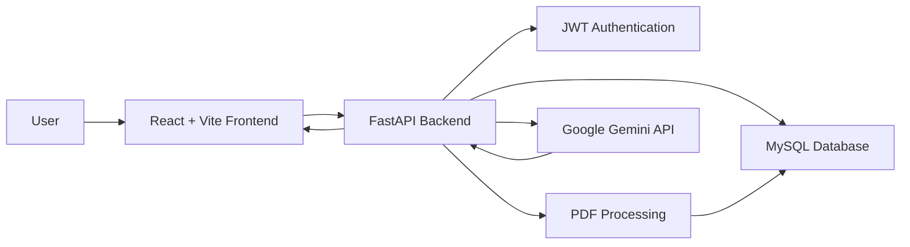

# 🤖 AI-Powered Research Assistant

> An AI-powered research workspace for understanding PDF documents through automatic summarization and document-based question answering.

The **AI-Powered Research Assistant** allows users to upload PDF documents, generate AI-powered summaries, ask questions about their documents, and continue conversations through a ChatGPT-style interface.

---

## ✨ Features

### 🔐 Secure Authentication
- User registration and login
- Password hashing with Argon2
- JWT-based authentication
- Protected backend API endpoints
- User-specific document and conversation access

### 📄 PDF Document Processing
- Upload PDF documents
- Extract text from PDF files
- Store document information in MySQL
- Generate an AI summary from the extracted content
- Securely open uploaded PDFs

### 🧠 AI-Powered Question Answering
- Ask questions about uploaded documents
- Generate responses using Google Gemini
- AI responses are rendered with Markdown
- Responses are designed to stay grounded in the available document content

### 💬 Conversation Management
- Multiple messages can belong to one conversation
- Conversation IDs are stored in the database
- Recent conversations appear in the sidebar
- Delete complete conversations
- Continue asking questions within an existing conversation

### 🖥️ ChatGPT-Style Interface
- Dark sidebar for recent conversations
- New Chat functionality
- Document summary section
- Question and answer workspace
- Open PDF button
- Logout functionality

---

## 🛠️ Tech Stack

| Layer | Technologies |
|------|--------------|
| Frontend | React, Vite, JavaScript, React Markdown |
| Backend | Python, FastAPI, Pydantic |
| Database | MySQL, SQLAlchemy |
| Authentication | JWT, Argon2 password hashing |
| AI | Google Gemini API |
| PDF Processing | PyPDF |
| API | REST APIs |
| Development | VS Code, Git, GitHub |

---

## 🏗️ System Architecture



---

## 🔄 Application Workflow

```text
                ┌──────────────────────┐
                │        User          │
                └──────────┬───────────┘
                           │
                           ▼
                ┌──────────────────────┐
                │ React / Vite Frontend│
                └──────────┬───────────┘
                           │
                           ▼
                ┌──────────────────────┐
                │    FastAPI Backend   │
                └──────┬─────┬─────┬───┘
                       │     │     │
              ┌────────┘     │     └────────┐
              ▼              ▼              ▼
        ┌──────────┐   ┌──────────┐   ┌───────────┐
        │   PDF    │   │  MySQL   │   │  Gemini   │
        │Processing│   │ Database │   │    AI     │
        └──────────┘   └──────────┘   └───────────┘
```

### Example flow

```text
Upload PDF
    ↓
Extract PDF text
    ↓
Store document information
    ↓
Send document content to Gemini
    ↓
Generate summary
    ↓
User asks a question
    ↓
FastAPI sends question + document content to Gemini
    ↓
AI response returned to React
```

---

## 📁 Project Structure

```text
AI-Powered-Research-Assistant/
│
├── backend/
│   ├── ai_service.py
│   ├── create_tables.py
│   ├── database.py
│   ├── gemini_api_test.py
│   ├── main.py
│   ├── models.py
│   ├── schemas.py
│   ├── test_gemini.py
│   └── text
│
├── databases/
│   ├── schema.sql
│   └── seed.sql
│
├── frontend/
│   ├── public/
│   ├── src/
│   │   ├── App.jsx
│   │   ├── App.css
│   │   ├── index.css
│   │   └── main.jsx
│   ├── package.json
│   └── vite.config.js
│
├── .env.example
├── .gitignore
└── README.md
```

---

## 🚀 Getting Started

### 1. Clone the repository

```bash
git clone https://github.com/BikramKeshariSwain/AI-Powered-Research-Assistant.git
cd AI-Powered-Research-Assistant
```

---

## ⚙️ Backend Setup

Open a terminal inside the `backend` directory:

```bash
cd backend
```

### Create a virtual environment

```bash
python -m venv venv
```

### Activate the virtual environment

**Windows PowerShell:**

```powershell
.\venv\Scripts\Activate.ps1
```

### Install dependencies

If a `requirements.txt` file is added to the project, install with:

```bash
pip install -r requirements.txt
```

Otherwise, install the backend dependencies used by the project.

### Configure environment variables

Create:

```text
backend/.env
```

Example:

```env
GEMINI_API_KEY=your_gemini_api_key
JWT_SECRET_KEY=your_jwt_secret
DATABASE_URL=your_database_connection
```

> ⚠️ Never commit the real `.env` file to GitHub.

### Start FastAPI

```bash
uvicorn main:app --reload
```

Backend:

```text
http://127.0.0.1:8000
```

Swagger API documentation:

```text
http://127.0.0.1:8000/docs
```

---

## 🌐 Frontend Setup

Open another terminal:

```bash
cd frontend
```

Install dependencies:

```bash
npm install
```

Start the development server:

```bash
npm run dev
```

Frontend:

```text
http://localhost:5173
```

---

## 🔒 Security

The application includes several security measures:

- Password hashing using Argon2
- JWT authentication
- Protected API endpoints
- User-specific document authorization
- User-specific conversation authorization
- Protected PDF access
- Environment variables for sensitive credentials
- `.env` excluded from version control

---

## 💡 Why I Built This Project

Research papers and technical PDFs often contain a large amount of information that can be difficult to process quickly.

This project explores how AI can be combined with:

- Document processing
- REST APIs
- Databases
- Authentication
- Modern web interfaces

to create a practical research assistant that helps users interact with their documents more efficiently.

---

## 🧠 What I Learned

Through this project, I practiced:

- Building REST APIs with FastAPI
- Designing database models with SQLAlchemy
- Working with MySQL
- Implementing JWT authentication
- Secure password hashing
- Handling PDF uploads and text extraction
- Integrating Google Gemini
- Connecting React with FastAPI
- Managing frontend state
- Designing conversation-based application flows
- Protecting user-specific resources
- Using Git and GitHub for version control

---

## 🚧 Future Improvements

The project is still under active development.

Planned improvements include:

- 🧠 Persistent conversation context for Gemini
- 🔎 Retrieval-Augmented Generation (RAG)
- 📚 Support for multiple documents in a conversation
- ⚡ Streaming AI responses
- 📝 Automatic conversation titles
- 📱 Improved responsive design
- 📄 Support for additional document formats
- 🔍 Semantic document search
- 🎨 Further UI/UX improvements

---

## 📸 Screenshots

### Login

_Add project screenshot here._

### Research Workspace

_Add project screenshot here._

### AI Summary

_Add project screenshot here._

### Conversation

_Add project screenshot here._

---

## 🎯 Project Status

**Current Status:** 🟡 Active Development

The core workflow is implemented:

```text
Authentication
     ↓
PDF Upload
     ↓
PDF Text Extraction
     ↓
AI Summary
     ↓
Document Questions
     ↓
Conversation Management
     ↓
Secure PDF Access
```

More advanced AI conversation memory and retrieval features are planned for future iterations.

---

## 👨‍💻 Author

### Bikram Keshari Swain

**B.Tech Computer Science Engineering Student**

📌 GitHub:  
https://github.com/BikramKeshariSwain

---

## ⭐ Support

If you find this project interesting, consider giving the repository a ⭐ on GitHub.